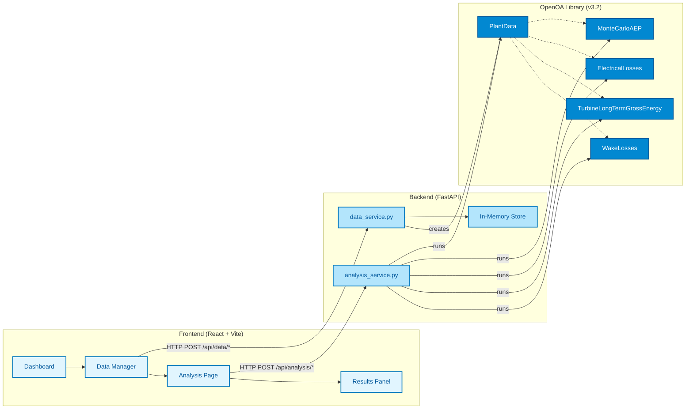

# OpenOA Application

OpenOA (Open Operational Analysis) is a web application that wraps the [OpenOA Python library](https://github.com/NREL/OpenOA) to provide wind energy operational analysis capabilities through a modern web interface.

## 🌟 Features

*   **Data Management**: Upload and manage SCADA and reanalysis data.
*   **Operational Analysis**:
    *   **Monte Carlo AEP**: Annual Energy Production estimation with uncertainty.
    *   **Electrical Losses**: Quantification of electrical losses.
    *   **Turbine Long-Term Gross Energy**: Validation of turbine performance.
    *   **Wake Losses**: Estimation of wake effects.
*   **Interactive Visualization**: View analysis results with dynamic charts and graphs.
*   **Modern Stack**: Built with React (Frontend) and FastAPI (Backend).

## 🏗️ Architecture

The application follows a client-server architecture:



## 📂 Project Structure

```
openoa-app/
├── backend/                 # FastAPI Backend
│   ├── app/
│   │   ├── main.py          # Application entry point
│   │   ├── services/        # Business logic (analysis, data)
│   │   ├── routers/         # API endpoints
│   │   └── models/          # Pydantic models
│   ├── Dockerfile           # Backend Dockerfile
│   └── requirements.txt     # Python dependencies
├── frontend/                # React Frontend
│   ├── src/
│   │   ├── components/      # UI Components
│   │   ├── pages/           # Page Components
│   │   ├── api.js           # API client
│   │   └── App.jsx          # Main App component
│   ├── index.html           # HTML entry point
│   └── vite.config.js       # Vite configuration
└── docker-compose.yml       # Docker Compose configuration
```

## 🚀 Getting Started

### Prerequisites

*   [Docker](https://www.docker.com/) and [Docker Compose](https://docs.docker.com/compose/)
*   **Or** for local development:
    *   Python 3.10+
    *   Node.js 18+

### Option 1: Run with Docker (Recommended)

1.  **Build and start the containers:**

    ```bash
    docker-compose up --build
    ```

2.  **Access the application:**
    *   Frontend: `http://localhost:5173`
    *   Backend API Docs: `http://localhost:8000/docs`

### Option 2: Run Locally (Development)

#### Backend Setup

1.  Navigate to the backend directory:
    ```bash
    cd backend
    ```

2.  Create a virtual environment and activate it:
    ```bash
    python -m venv venv
    source venv/bin/activate  # On Windows: venv\Scripts\activate
    ```

3.  Install dependencies:
    ```bash
    pip install -r requirements.txt
    ```

4.  Run the application:
    ```bash
    uvicorn app.main:app --reload
    ```
    The backend will start at `http://localhost:8000`.

#### Frontend Setup

1.  Navigate to the frontend directory:
    ```bash
    cd frontend
    ```

2.  Install dependencies:
    ```bash
    npm install
    ```

3.  Start the development server:
    ```bash
    npm run dev
    ```
    The frontend will start at `http://localhost:5173`.

## 📖 API Documentation

The backend provides interactive API documentation via Swagger UI. Once the backend is running, visit:

`http://localhost:8000/docs`

## 🛠️ Usage Flows

1.  **Upload Data**: Go to the **Data Manager** page to upload your wind plant data (SCADA, Meter, Reanalysis) or load the **Example Dataset**.
2.  **Configure Analysis**: Navigate to the **Analysis** page. Select the type of analysis (e.g., AEP, Wake Losses) and configure parameters.
3.  **Run & View Results**: Click "Run Analysis". The results will be displayed with key metrics and interactive visualizations.

## ☁️ Deployment

### Google Cloud Run

To deploy the backend to Google Cloud Run:

1.  **Build and Push Docker Image**:
    ```bash
    gcloud builds submit --tag gcr.io/PROJECT-ID/openoa-backend backend/
    ```

2.  **Deploy to Cloud Run**:
    ```bash
    gcloud run deploy openoa-backend \
      --image gcr.io/PROJECT-ID/openoa-backend \
      --platform managed \
      --region us-central1 \
      --allow-unauthenticated
    ```

3.  **Update Frontend**: Update `VITE_API_URL` in your frontend configuration to point to the deployed Cloud Run URL.

---
*Built with ❤️ for the Wind Energy Community*
